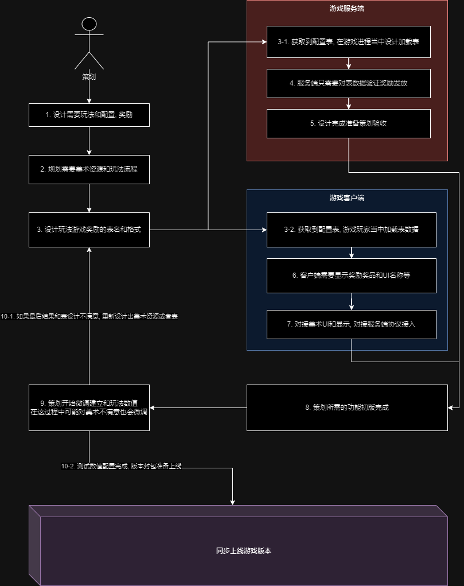

# H5游戏服务端

基于 [actor-spring-boot-starter](https://github.com/MeteorGX/actor-spring-boot-starter) 设计的 WebSocket 服务端

游戏客户端则是基于 [actor-spring-boot-client](https://github.com/MeteorGX/actor-spring-boot-client) 开发,
这里仅仅做H5网络游戏开发设计的思维流程.

>
具体开发思维可以参考 [H5服务端开发思考](https://www.meteorcat.net/tags/h5%E6%B8%B8%E6%88%8F%E6%9C%8D%E5%8A%A1%E7%AB%AF/)

## SDK对接

常规来说商业游戏会接入第三方授权账号体系, 甚至于自己本身都有带的账号密码登录体系, 这里最好抽离出来和服务器列表|公告列表单独做系统服务.

> 第三方账号验证体系不要加在游戏服务端, 有时候第三方SDK会频繁更新需要重启或者断点日志等情况

最基本账号密码登录授权 UML 流程如下:


这里已经采用 `python` 编写好协议同步工具:

```shell
# 将策划配置的 CSV 表转化为通用 JSON 格式提供给服务端和客户端使用
.\tools\csv2json.py -i .\table\ -o .\target\ -e gbk
```

> 需要注意: 加载配置表的功能写成热更新处理, 因为上线过程最常见策划配置奖励临时需要修改

## 协议对接

注意通讯协议并不是服务端独有, 通讯协议是 `服务端和客户端` 共同维护处理, 授权流程 UML 如下:


这里已经采用 `python` 编写好协议同步工具:

```shell
# 将内部协议 JSON 转化成支持 Java/Python/Lua/C# 等格式文件
# 客户端和服务端可以直接转化并取用
.\tools\protocol.py -i .\protocol\ -o .\target\
```

> 协议最好独立版本库让客户端和服务端一起维护, 可以直接建立 GIT|SVN 库来另外同步

## 策划对接

> 注意: 策划基本上不接触代码的, 所以尽可能避免让其接触命令行处理, 最多让其用 `Python` 处理.

能够界面化处理的事情不要用命令行处理, 策划大部分只需要关注游戏数值配置, 所以 Excel 才是策划和程序对接手段.

一般来说策划和程序开会确定版本要求功能, 常规来说会得出以下结果:

- 版本号和版本上线时间: 假设上线所需一周则需要调用美术|程序|外包等流程保证开发不会突然停滞
- 需要上线的功能: 一般需要准备上线的游戏玩法和活动等信息, 用于协调美术和客户端游玩逻辑
- 需要配置的策划表: 设计定义出玩法收益数值表和奖励配置表, 用于给客户端和服务端读取加载

了解这些信息之后就可以准备游戏开发的设计流程:



> 策划配置表基本是另外处理版本库, 常规都是 SVN 提交上同步分发给客户端和服务端处理


