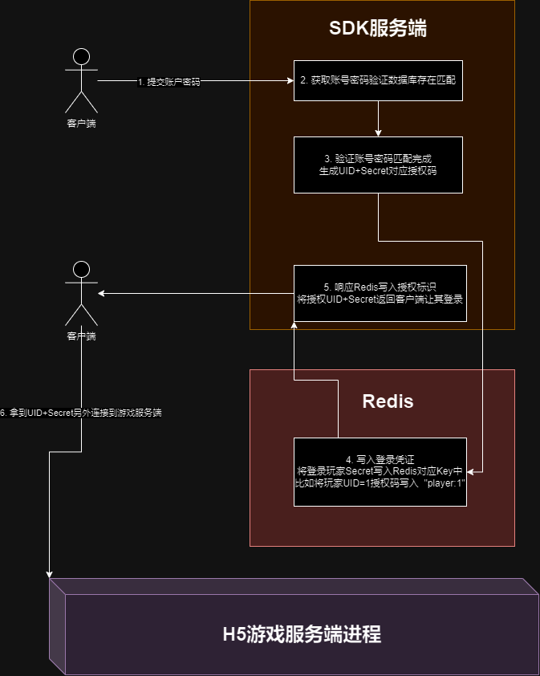
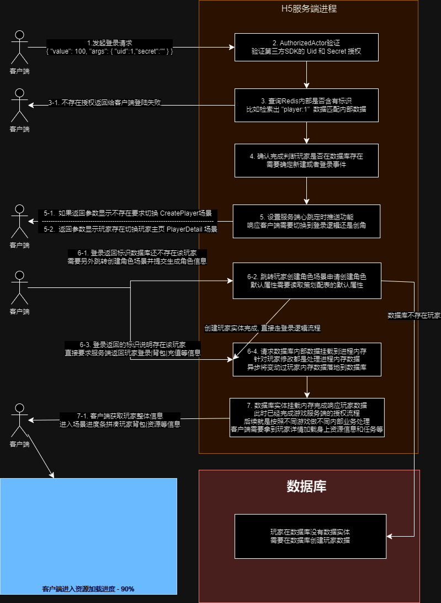

# H5游戏服务端

基于 [actor-spring-boot-starter](https://github.com/MeteorGX/actor-spring-boot-starter) 设计的 WebSocket 服务端

游戏客户端则是基于 [actor-spring-boot-client](https://github.com/MeteorGX/actor-spring-boot-client) 开发, 这里仅仅做H5网络游戏开发设计的思维流程.

> 具体开发思维可以参考 [H5服务端开发思考](https://www.meteorcat.net/tags/h5%E6%B8%B8%E6%88%8F%E6%9C%8D%E5%8A%A1%E7%AB%AF/)

## SDK对接

常规来说商业游戏会接入第三方授权账号体系, 甚至于自己本身都有带的账号密码登录体系, 这里最好抽离出来和服务器列表|公告列表单独做系统服务.

> 第三方账号验证体系不要加在游戏服务端, 有时候第三方SDK会频繁更新需要重启或者断点日志等情况

最基本账号密码登录授权 UML 流程如下:



## 协议对接

注意通讯协议并不是服务端独有, 通讯协议是 `服务端和客户端` 共同维护处理, 授权流程 UML 如下:



这里已经采用 `python` 编写好协议同步工具:

```shell
# 将内部协议 JSON 转化成支持 Java/Python/Lua/C# 等格式文件
# 客户端和服务端可以直接转化并取用
.\tools\protocol.py -i .\protocol\ -o .\target\
```

> 协议最好独立版本库让客户端和服务端一起维护, 可以直接建立 GIT|SVN 库来另外同步

